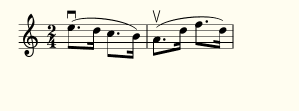
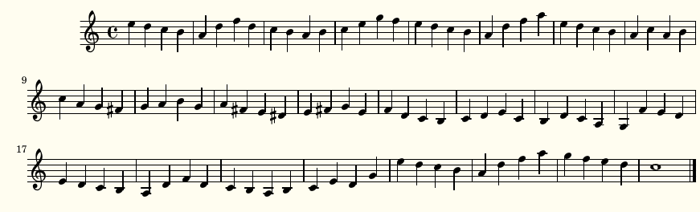
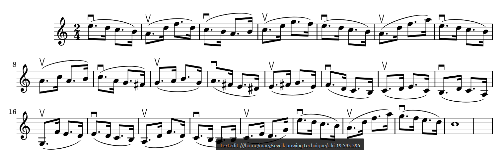
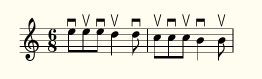
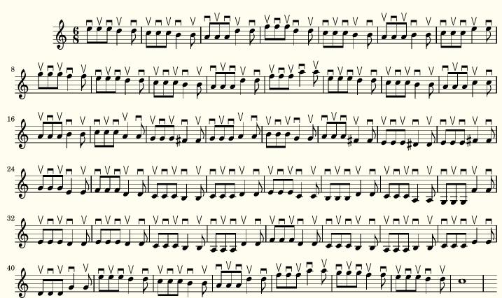
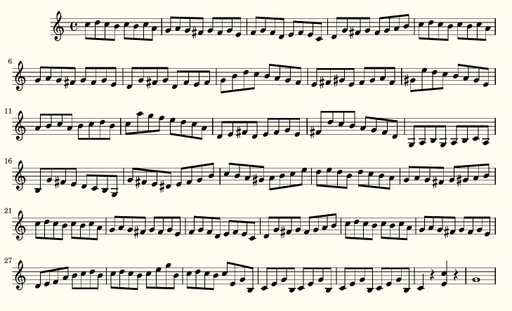
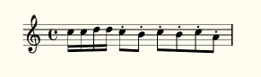
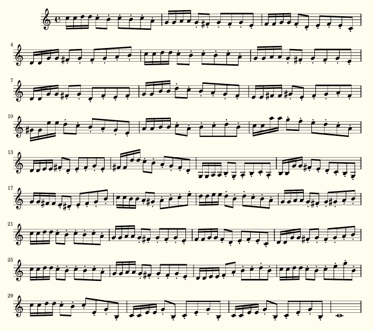

 
#j'ai joue autumn leaves solo
- autumn1 ly => notes de autumn leaves (lilypond)
* autumn2 ly rythmne seulement de autumn leaves (lilypond)
```bash
  ruby wownote rb 
```


* est pour avoir seulement les notes de la melodie de autumn leaves (le script autumn1 lilypond) ecrire dans un fichier mesnotes.music
```bash
cp autumn2 ly automne.rythme 
```
 * ruby wowrythme rb est pour remplacer les notes des rythme par des # et "Manote"
```bash
cp automne.rythme rythme.automne
```
*  ruby wowmusic rb est pour remplacer rythmne automne avec les notes de autumn leaves 
# bienvenue 
P
* c'est pour associer des rythmne et notes , 1 script de rythme n°1 et de note n°2
* scripts : wonderful_1 et wonderful_2
```bash
sh yeah.sh wonderful 0
```
* si la partition c'est deja ecrit (2 semi tones higher)
```bash
sh ./partition.sh autumn-leaves-violin.ly 2
```
### sevcik
-  il y a un texte , et sevcik fait des coups d'archet
* si les notes c'est deja ecrit, il faut jouer la meme melodie  en jouant 0 semi tones higher or lower,  mais le rythmne il faut repeter la mesure 12 fois , tu as donne seulement 2 mesures, de rythme (ecris 2)  pour jouer tout le texte des notes, il faut jouer 24 mesures de notes
- dans bow_2, tu peux faire des mesures diffrente 4/4 3/4
- dans bow2 , tu fais quelque chose avec le nombre de notes differentes dans chaque mesure, si dans la mesure, mi re do si, pour faire marcher ce programme, un rythme, avec coups d'archet seulement avec mi re do si pour 1 mesure, sur 2 mesures, avec les notes de 2 mesures
- 1er argument nom du script _1 et _2, ex bow, bow_1, bow_2
-  semi tones higher lower
- nombre de mesures coup d'archet
- nombre de mesures dans le texte

```bash
sh ./texterythme.sh bow 0 2 24
```
- dans wowrythme.rb, et wownoterythme.rb, il faut ajouter, staccato, upbow, downbow

```bash
sh ./texterythme.sh mybow 0 2 24
sh ./texterythme.sh yourscore 0  1 31
```
 - (0 semi tones higher or lower), il y a 2 mesures (2 mesures du texte dans mybow1, mais en combien de mesures 1 ou plusieurs mesures) pour voir le rythme, il y a 24 mesures dans le texte de notes,
- le text est dans mybow_1, je modifie seulement mybow_2


- score like 
````
MvmntIVoiceI = \relative { r4 d''8\noBeam g, c4 r }
words  = \lyricmode { And God said, }
upper  = \relative { <g' d g,>2~ <g c, g> }
lower  = \relative { b,2 e }

\score {
  <<
    \new Staff = "" <<
      \new Voice = "MvmntIVoiceI" { \MvmntIVoiceI }
      \addlyrics { \words }
    >>
  >>
  \layout { }
````


# autumn-leaves-lilypond
# sevcik-bowing-technique
  
  
  
  
  
  
  
  
